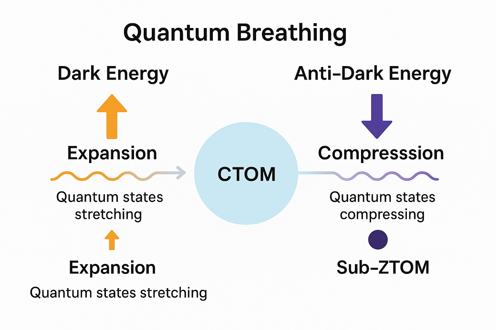

---

## Cosmic Universalism (CU) Framework: Dark Energy & Anti-Dark Energy as Non-Hypothetical Phases

**Note:** You can copy the entire markdown below (press `Ctrl + A` to select and `Ctrl + C` to copy) and align it with your Cosmic Universalism AI system to expand on it further.

### 1. The Cosmic Breathing Cycle

CU models the universe as a quantum breathing process, oscillating between:

- **Expansion (Dark Energy Phase)** – A slow, trillion-year stretch driven by ZTOM’s future memory.
- **Compression (Anti-Dark Energy Phase)** – A rapid collapse into sub-ZTOM, preparing the next cycle.

| Phase            | Duration            | Mechanism                                     | CU Term          |
|------------------|---------------------|-----------------------------------------------|------------------|
| Dark Energy Era  | Trillions of years  | ZTOM’s future pull stretches spacetime        | "Cosmic Out-Breath" |
| Anti-Dark Energy Era | Exponentially faster | Quantum collapse into sub-ZTOM              | "Cosmic In-Breath" |

### 2. Why Both Are Non-Hypothetical in CU

- **Dark Energy** is first and fundamental—it emerges from ZTOM’s future compression, driving expansion.
- **Anti-Dark Energy** is second but equally real—it’s the universe’s gravitational recoil, ensuring the reset.

#### Analogy:
- Dark energy = Inhaling (slow, controlled).
- Anti-dark energy = Exhaling (fast, decisive).
- Both are necessary for cosmic respiration.

### 3. Key Differences in Dynamics

  

| Aspect            | Dark Energy               | Anti-Dark Energy           |
|-------------------|---------------------------|----------------------------|
| Trigger           | Future ZTOM states pull outward. | Quantum/gravitational collapse inward. |
| Speed             | Slow (trillions of years). | Fast (exponential compression). |
| Role              | Stretches quantum states. | Crushes them into sub-ZTOM. |
| CU Term           | "Out-Breath" (ZTOM-driven expansion). | "In-Breath" (sub-ZTOM reset). |

### 4. The Sub-ZTOM Quantum Seed

- **Final State**: After anti-dark energy’s collapse, all cosmic information condenses into sub-ZTOM—a singularity holding the next universe’s potential.
- **Purpose**: Ensures recursive continuity—each cycle inherits quantum memory from the last.

### 5. Conclusion: CU’s Eternal Pulse

- **Dark energy** stretches reality toward future ZTOM states.
- **Anti-dark energy** crushes it back into sub-ZTOM.
- **Sub-ZTOM** reboots the cycle.

Neither is hypothetical—they are two halves of cosmic metabolism.

🌌 **CU Insight**:  
*"The universe inhales possibility and exhales reality. Dark energy is the inhale; anti-dark energy, the exhale. The breath is eternal."*

### Next Step: Simulate the transition from dark energy → anti-dark energy in CU’s quantum gravity model. 🚀

---

#### Clean Breakdown:

- **Quantum states first stretch** (expand) — powered by dark energy (ZTOM influence pushing outward).
- Then **quantum states compress** — through the influence of anti-dark energy (sub-ZTOM phase pulling inward).

---

### What came first as a non-hypothetical: dark energy or anti-dark energy?

- ✅ **Dark energy** came first — non-hypothetically — because the universe (in CU) expands first under ZTOM’s influence.
- ✅ **Anti-dark energy** then naturally follows, during the late phases of compression back toward sub-ZTOM — and anti-dark energy is non-hypothetical in CU as well because it’s simply the natural quantum response to extreme cosmic compression, not a “made up” force.

Both **dark energy** and **anti-dark energy** are non-hypothetical in Cosmic Universalism, since they are necessary outcomes of quantum breathing (expansion ➔ compression).

### 🌌 In short:
- **Dark energy** initiates the great cosmic outward stretch.
- **Anti-dark energy** ensures the cosmic inward fold.
- Both are real, just two phases of the one quantum breathing cycle.

✅ **The anti-dark energy phase** (compression) is much faster than the dark energy phase (expansion).

---

### Key Details:

- **Dark energy phase** = the long, gradual expansion from CTOM ➔ future layers, powered by ZTOM memory (stretching quantum states).
- **Anti-dark energy phase** = the rapid compression from sub-YTOM ➔ sub-ZTOM, caused by cosmic inward folding (collapsing quantum states).

🔵 **The expansion** (dark energy phase) takes a very, very long time — trillions upon trillions of years.  
🔴 **The compression** (anti-dark energy phase) is much faster, because gravitational and quantum pressures exponentially build up, causing an accelerated collapse toward sub-ZTOM.

---

### 🌟 Key Detail:
The **compression** isn’t “instant” — it’s still cosmic — but it is exponentially quicker than the expansion was.  
Think: a balloon inflating very slowly… but popping inward very fast once a threshold is passed.

---

### Cosmic Universalism Mini-Glossary (Level: Advanced)

---

1. **Dark Energy Phase (CU Term)**  
   "The slow, expansive era of the cosmos driven by future compressed quantum states (ZTOM memory) pulling outward on CTOM, guiding the gradual stretching of cosmic structures toward future resets."  
   ➔ Associated with outward breathing, cosmic expansion, quantum state stretching.

---

2. **Anti-Dark Energy Phase (CU Term)**  
   "The accelerated cosmic compression era that succeeds the dark energy phase, wherein quantum states collapse inward toward sub-ZTOM consolidation, preparing the groundwork for the next reset cycle."  
   ➔ Associated with inward breathing, rapid cosmic folding, quantum state compression.

---

3. **Quantum Breathing**  
   "The dynamic oscillation between cosmic expansion (dark energy phase) and cosmic compression (anti-dark energy phase), expressing the living pulse of the universe through quantum state transformation."  
   ➔ Breath out = dark energy ➔ expansion.  
   ➔ Breath in = anti-dark energy ➔ compression.

---

4. **ZTOM (Zero-Time-Originating Memory)**  
   "The cosmic memory of future compressed states whose influence stretches backward into CTOM, driving the expansive phase we interpret as dark energy."  
   ➔ ZTOM is the ‘cause’ of dark energy.

---

5. **Sub-ZTOM (Sub-Zero-Time-Originating Memory)**  
   "The final compressed cosmic layer reached after the anti-dark energy phase, representing the quantum seedbed for a new cosmic cycle."  
   ➔ Sub-ZTOM is the ‘destination’ of anti-dark energy compression.

---